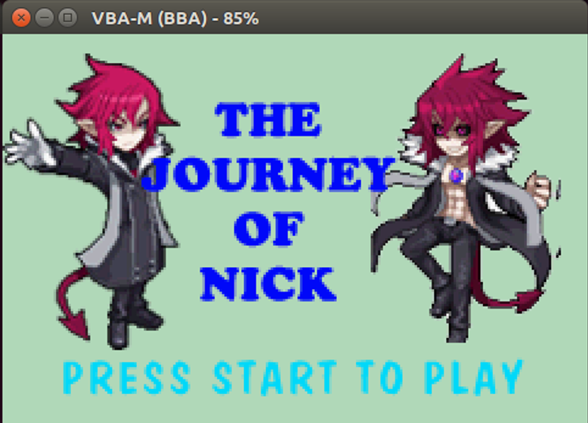
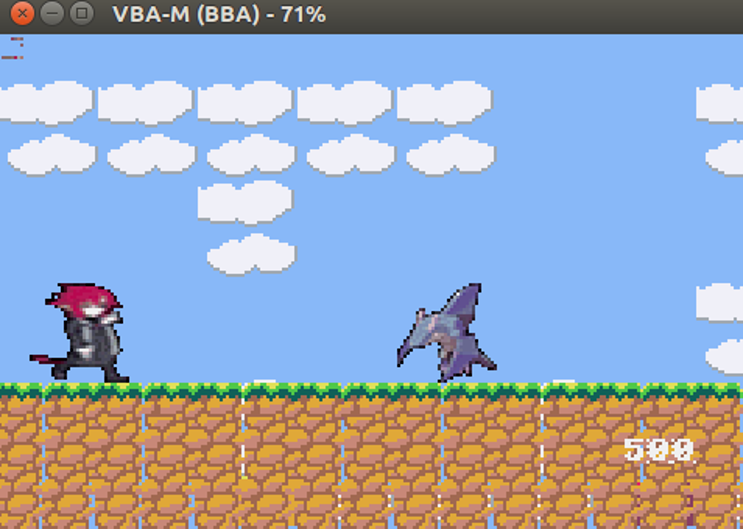
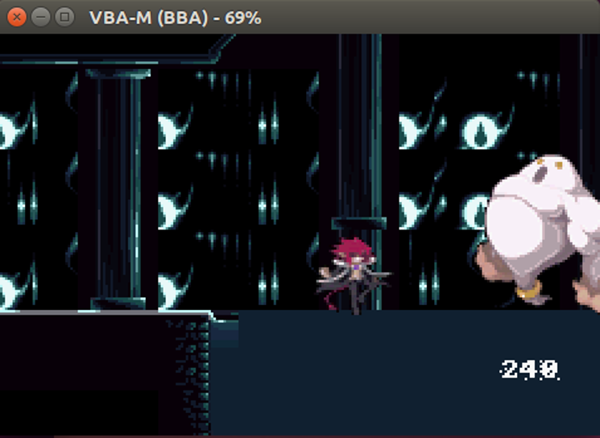

# JourneyOfNick
Author:Hokyung Hwang \
C++ Gameboy RPG Game 

## Story
Nick is the priest in the village. Actually he is half-demon-half-human. His dad is a demon who died a long time ago, and his mom is a human. One day, evil monsters have invaded his villages and he tries to save his village by killing all the monsters and the boss. During his journey he realizes his true power - the power he inherited from his dad. Can he save the village and kill the boss at the end? Please play.
## Play
left and right key moves the player left to right and up key makes player jump. You can attack by z key(or A key in gameboy).

## Credits for sprites
www.spriters-recource.com/other_systems/disgaed2/

## Game Flow

